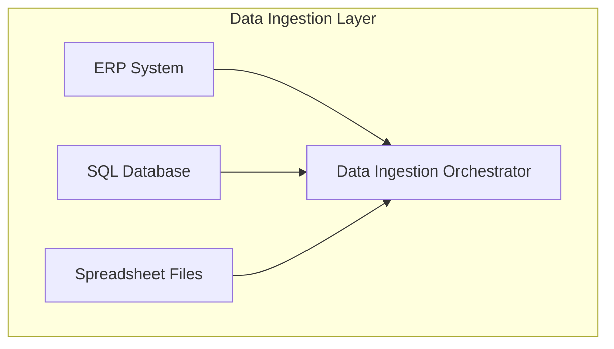
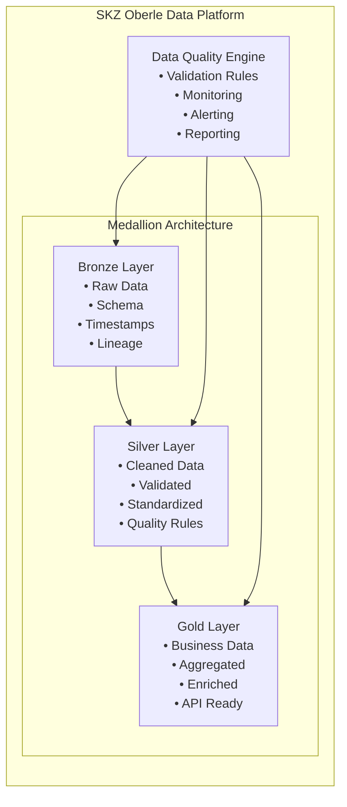
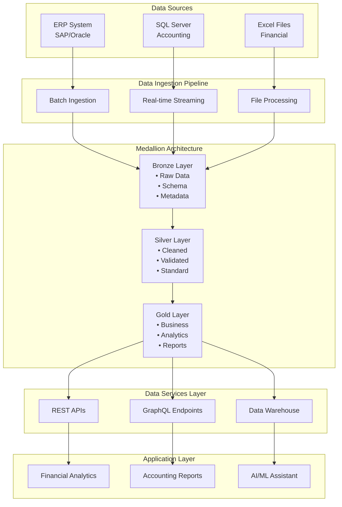

# Architectural Tactics for Data Flow and Transformations

## Self-Study Resources

### Required Reading

| Resource | Topic | Focus Area | Estimated Time |
|----------|-------|------------|----------------|
| [Case Study: Medallion Architecture in an E-Commerce Company](https://cobalt-blarney-8b3.notion.site/Case-Study-Medallion-Architecture-in-an-E-Commerce-Company-25a256ceaea780feb249d8968878f9fb) | Medallion Architecture Implementation | Real-world application of Bronze, Silver, Gold layers in enterprise context | 45 minutes |
| [The Easy Guide to Component Diagrams](https://creately.com/blog/software-teams/component-diagram-tutorial/) | UML Component Diagrams | Component notation, interfaces, dependencies, and best practices | 30 minutes |
| [The Race For Data Quality in a Medallion Architecture](https://datakitchen.io/the-race-for-data-quality-in-a-medallion-architecture/) | Data Quality in Medallion Architecture | Quality controls, monitoring, and governance across architecture layers | 25 minutes |

 

## Case Study: Medallion Architecture in E-Commerce

### Business Context
Our project involves creating a unified data platform for SKZ Oberle, integrating fragmented data sources (ERP systems, SQL databases, spreadsheets) into a centralized, scalable architecture.

### Key Requirements
- **Data Integration**: Multiple source systems (ERP, databases, spreadsheets)
- **Data Quality**: Automated validation and cleansing processes
- **Scalability**: Handle growing data volumes and user demands
- **Security**: Enterprise-grade access control and audit trails
- **Future-Ready**: Foundation for AI/ML and natural language interfaces

## UML Component Diagrams for Big Data Architecture

### Component Diagram Fundamentals

Based on [Creately's Component Diagram Tutorial](https://creately.com/blog/software-teams/component-diagram-tutorial/), component diagrams visualize system architecture by showing:

- **Components**: Modular parts that encapsulate functionality
- **Interfaces**: How components interact (provided/required)
- **Dependencies**: Relationships between components
- **Ports**: Delegation points for internal interactions

Suggested tools for diagramming: [Lucidchart](https://www.lucidchart.com) and [draw.io (diagrams.net)](https://www.diagrams.net/).

### Big Data Architecture Components

#### 1. Data Ingestion Layer



#### 2. Medallion Architecture Layers

**Bronze Layer (Raw Data)**
- Raw data ingestion and storage
- Minimal processing and validation
- Historical data preservation
- Schema evolution support

**Silver Layer (Cleaned Data)**
- Data quality validation
- Standardization and normalization
- Business rule application
- Data lineage tracking

**Gold Layer (Business-Ready Data)**
- Aggregated and enriched data
- Business metrics and KPIs
- Analytics-ready datasets
- API-ready data products

### Component Diagram Symbols and Usage

#### Component Notation
- **Rectangle with <<component>>**: Standard component representation
- **Rectangle with component icon**: Visual component identification
- **Rectangle with both icon and stereotype**: Complete component definition

#### Interface Types
- **Provided Interface (Circle)**: Services offered by component
- **Required Interface (Semi-circle)**: Services needed by component
- **Assembly Connector**: Links provided and required interfaces

#### Ports and Dependencies
- **Ports**: Small squares for interface delegation
- **Dependencies**: Dashed arrows showing component relationships

## Medallion Architecture Implementation

### Architecture Overview



### Data Quality in Medallion Architecture

Based on [DataKitchen's insights on data quality in Medallion Architecture](https://datakitchen.io/the-race-for-data-quality-in-a-medallion-architecture/), implementing robust data quality controls is crucial:

#### Quality Gates by Layer

**Bronze Layer Quality Controls**
- Schema validation
- Data type checking
- Null value detection
- Duplicate identification

**Silver Layer Quality Controls**
- Business rule validation
- Referential integrity checks
- Data completeness verification
- Anomaly detection

**Gold Layer Quality Controls**
- Aggregation accuracy
- Metric consistency
- Performance validation
- Business logic verification

## SKZ Oberle Big Data Architecture Design

### Component Architecture



### Data Flow Patterns

#### 1. Batch Processing Pattern
```
Data Source → Ingestion → Bronze → Silver → Gold → API/Reports
```

#### 2. Real-time Processing Pattern
```
Data Source → Streaming → Bronze → Silver → Gold → Real-time Analytics
```

#### 3. Data Quality Pipeline
```
Data → Validation → Quality Rules → Monitoring → Alerting → Reporting
```

## Implementation Guidelines

### Component Design Principles

1. **Modularity**: Each component should have a single responsibility
2. **Loose Coupling**: Minimize dependencies between components
3. **High Cohesion**: Related functionality should be grouped together
4. **Interface Segregation**: Provide clear, focused interfaces
5. **Dependency Inversion**: Depend on abstractions, not concretions

### Data Quality Implementation

#### Quality Metrics
- **Completeness**: Percentage of non-null values
- **Accuracy**: Data correctness against business rules
- **Consistency**: Cross-system data alignment
- **Timeliness**: Data freshness and availability
- **Validity**: Data format and type compliance

#### Monitoring and Alerting
- Real-time quality dashboards
- Automated anomaly detection
- Data lineage tracking
- Performance monitoring
- Cost optimization tracking

## Graded Activity

### Activity Overview
- **Duration**: 1 hour (in-class)
- **Format**: Individual work
- **Points**: 3 points
- **Deadline**: 12:00 hours (exactly)

### Activity Description

Students are required to design a data architecture proposal that covers the entire data lifecycle, including data ingestion, data processing (treatment), and data visualization. The data visualization component must be an **infographic** that students will need to design using appropriate tools or creative methods. The architecture should clearly illustrate how data flows from sources through transformation stages to final presentation layers, emphasizing scalability, efficiency, and clarity.

### Activity Instructions

Design a data architecture proposal that covers the entire data lifecycle, including data ingestion, data processing (treatment), and data visualization. Your proposal should include a clear architectural diagram illustrating the flow of data from its sources through transformation stages to the final presentation layers. 

**Important**: The data visualization component must be designed as an **infographic**. You will need to:
- Research and select appropriate infographic creation tools
- Design a creative and informative infographic
- Integrate the infographic into your overall architecture design
- Explain how the infographic fits into the data flow

Emphasize scalability, efficiency, and clarity.

### Checklist for Coverage

Your architecture proposal must include:

- [ ] **Include all three lifecycle stages**: ingestion, processing, and visualization
- [ ] **Clearly identify data sources and ingestion mechanisms**
- [ ] **Show logical and well-structured processing/treatment steps**
- [ ] **Include data visualization or presentation components (infographic required)**
- [ ] **Demonstrate clear and organized data flow between components**
- [ ] **Provide explanations for the role of each component**
- [ ] **Address considerations for data quality, storage, and accessibility**
- [ ] **Reflect principles of scalability and system efficiency**


### Important Notes

- **Deadline**: Activity closes exactly at 12:00 hours
- **Format**: Individual work only
- **Submission**: Follow the platform instructions for submission
- **Late Submissions**: Will not be accepted after the deadline

---

*This lesson provides the foundation for designing robust, scalable Big Data architectures using industry-standard patterns and practices. Students will apply these concepts to design the SKZ Oberle data platform architecture.*